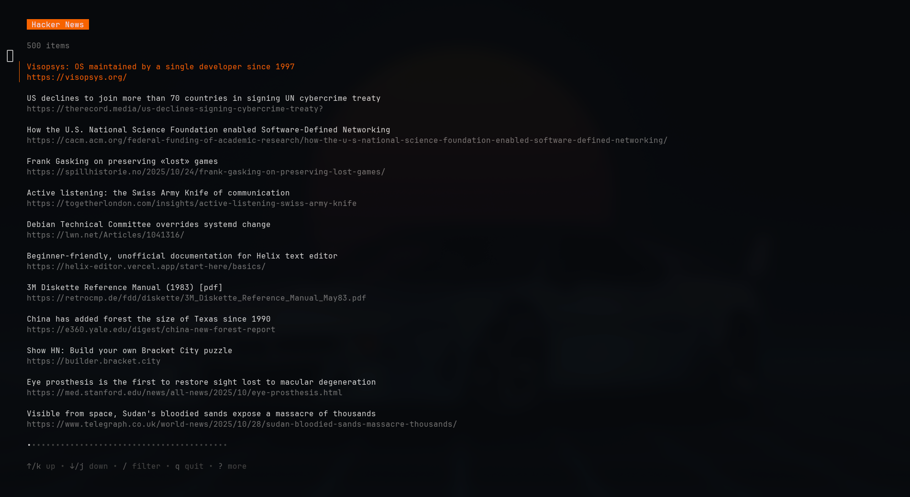

# Hacker News on the terminal

A simple CLI application to browse top Hacker News from the terminal.



## Installation

```bash
go install github.com/jermartinz/hnews@latest

```

## Building from Source

1. Clone the repository:

```bash
git clone https://github.com/jermartinz/hnews.git
cd hnews
```

2. Build the application:

```bash
go build -o hnews
```

3. (Optional) Install the binary to your `$GOPATH/bin`:

```bash
go install
```

4. Run the application:

```bash
./hnews
```

## Usage

1. Run the application:

```bash
hnews
```

2. Use the arrow keys to navigate through the stories.

3. Press `Enter` to open a story in your default web browser.

4. Press `q` to quit the application.

## Requirements

- Go 1.16 or higher

## Dependencies

This project uses the following main dependencies:

- **[Bubble Tea](https://github.com/charmbracelet/bubbletea)** - A powerful TUI framework for building terminal applications
- **[Bubbles](https://github.com/charmbracelet/bubbles)** - Common TUI components for Bubble Tea
- **[Lip Gloss](https://github.com/charmbracelet/lipgloss)** - Style definitions for terminal applications

## API Usage

This application uses the official [Hacker News Firebase API](https://github.com/HackerNews/API) to fetch stories:

- **Base URL**: `https://hacker-news.firebaseio.com/v0`
- **Endpoint used**: `/topstories.json` - Returns IDs of top stories
- **Item endpoint**: `/item/{id}.json` - Fetches individual story details

The application fetches all top story IDs and then retrieves their details concurrently for optimal performance.
